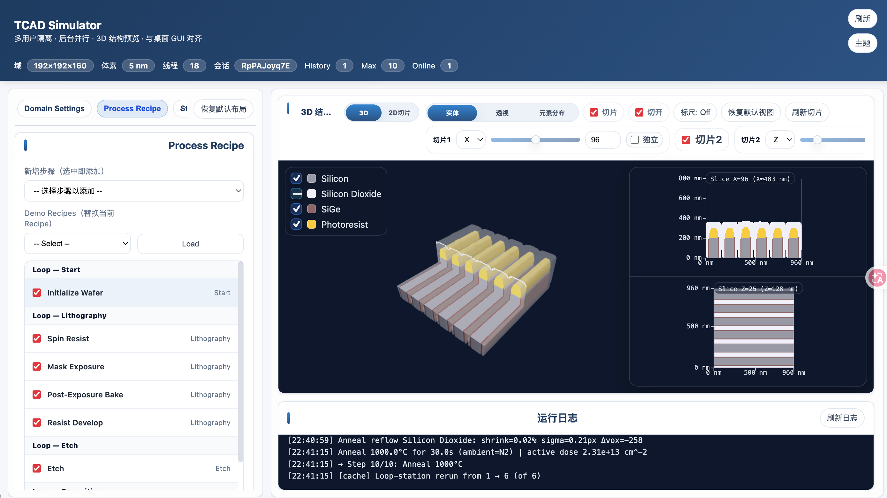
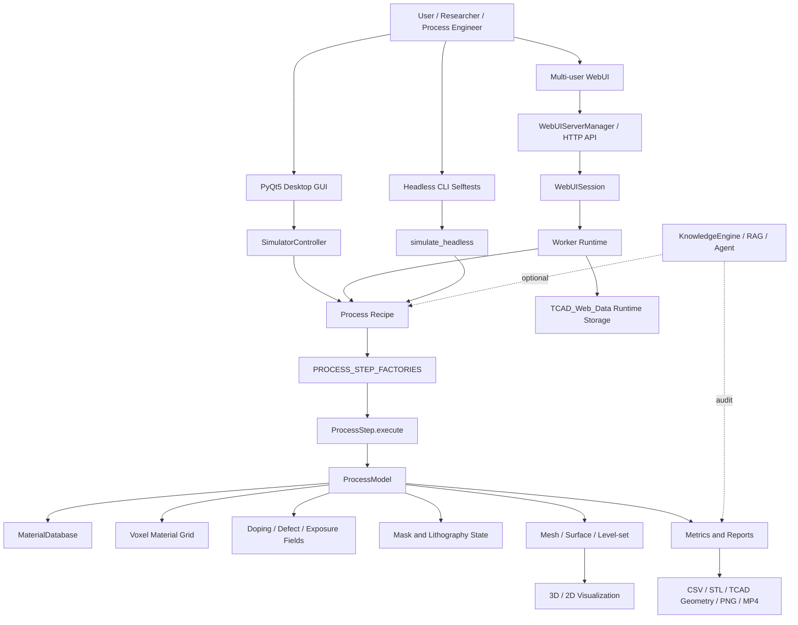
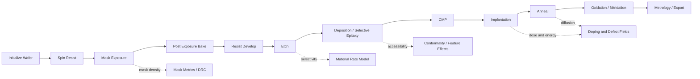
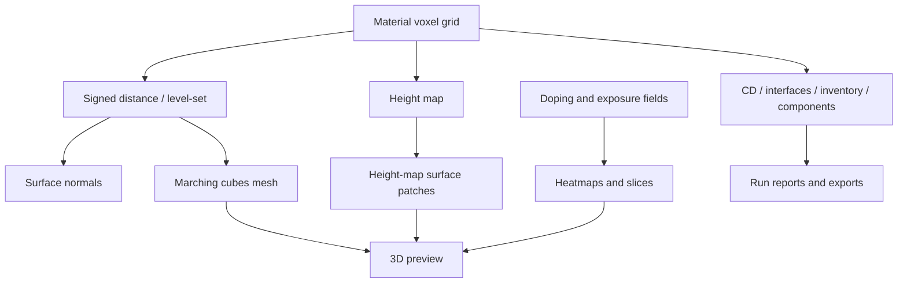
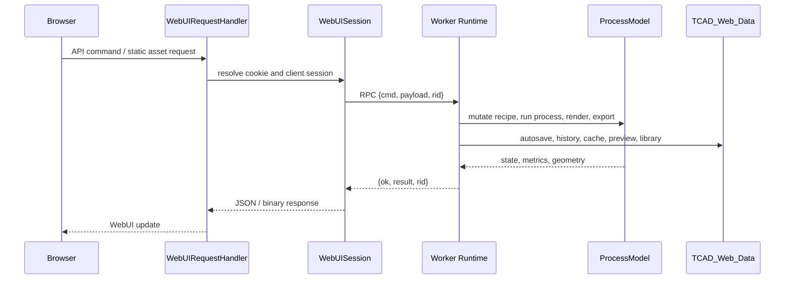
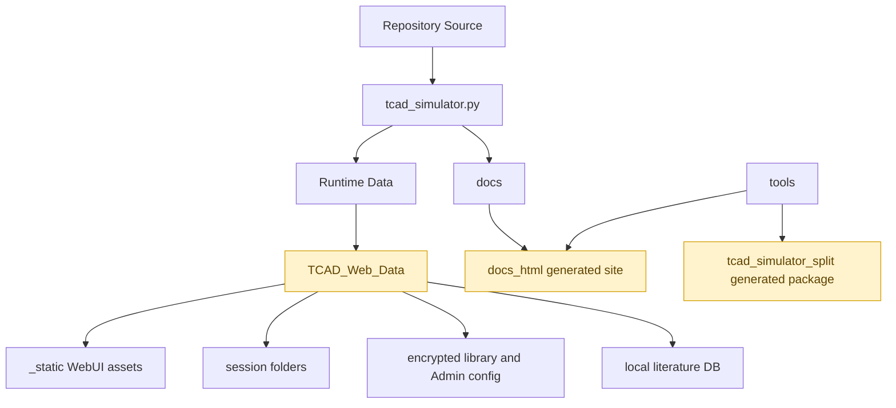

# TCAD Process Simulator

<p align="center">
  
</p>

<p align="center">
  <strong>Process-focused TCAD-like simulator for semiconductor fabrication workflows.</strong><br>
  <strong>面向半导体制程流程的 TCAD-like 工艺仿真平台。</strong>
</p>

<p align="center">
  <a href="LICENSE"></a>
  
  
  
  
</p>

`tcad_simulator.py` is the canonical single-file application. It combines process recipe editing, voxel-based wafer modeling, lithography/mask workflows, deposition, etch, CMP, implantation, annealing, oxidation/nitridation, metrology, 3D/2D visualization, export tools, a desktop GUI, a multi-user WebUI, and optional LLM-assisted recipe design.

`tcad_simulator.py` 是项目主入口和权威源码。它把工艺 recipe 编辑、体素晶圆模型、光刻/掩膜流程、沉积、刻蚀、CMP、离子注入、退火、氧化/氮化、测量、3D/2D 可视化、导出工具、桌面 GUI、多用户 WebUI 和可选 LLM recipe 辅助集成在一个单文件应用中。

> `tcad_simulator_split/` and `tcad_simulator_split.zip` are generated developer artifacts. They are useful for code inspection and reports, but they are not needed to run the simulator.
>
> `tcad_simulator_split/` 和 `tcad_simulator_split.zip` 是生成的开发辅助产物，可用于代码审查和报告，运行 simulator 不需要它们。

## Contents

- [Capabilities](#capabilities)
- [Architecture](#architecture)
- [Process Model](#process-model)
- [WebUI Runtime](#webui-runtime)
- [Installation](#installation)
- [Run](#run)
- [Documentation](#documentation)
- [Developer Tooling](#developer-tooling)
- [Runtime Data](#runtime-data)
- [License](#license)

## Capabilities

| Area | Features |
| --- | --- |
| Process TCAD workflow | Wafer initialization, lithography, deposition, selective epitaxy, etch, CMP, implantation, anneal, oxidation/nitridation, surface reactions |
| Voxel process kernel | Configurable `NX × NY × NZ` domain, nanometer voxel size, material grid, height map, mask state, doping/defect fields, snapshots |
| Lithography and mask | Spin resist, exposure, PEB, develop, image/NumPy/GDSII masks, mask designer, DRC-style metrics, process-window probes |
| Materials and recipes | Built-in material database, process parameters, Admin overrides, recipe JSON migration, presets, history, loop workflows |
| Visualization | 3D stack preview, material components, cross-sections, doping/exposure heatmaps, WebGL/host-assisted render paths |
| Metrology and export | CD/feature metrics, material inventory, interfaces, CSV, STL, TCAD geometry, PNG frame sequences, optional MP4 video |
| Desktop and WebUI | PyQt5 desktop application, multi-user WebUI, isolated sessions where supported, Admin UI, encrypted library storage |
| Knowledge and Agent | Optional PDF/literature ingestion, local retrieval, process mapping, physics audit, skills, LLM-assisted recipe drafting |

## Architecture



`ProcessModel` is the central state boundary. GUI, WebUI, headless execution, recipe import/export, and optional Agent proposals all converge through the same `ProcessStep.execute(model)` protocol.

`ProcessModel` 是核心状态边界。桌面 GUI、WebUI、headless 执行、recipe 导入导出和可选 Agent proposal 最终都会通过同一个 `ProcessStep.execute(model)` 协议进入工艺内核。

## Process Model





The numerical model is physics-inspired and designed for research, teaching, and process exploration. It is not a calibrated commercial TCAD sign-off tool.

该数值模型是 physics-inspired 的研究/教学/探索工具，不是经过工业标定的商业 TCAD sign-off 替代品。除非已经用真实工艺数据验证，否则生成的结构、掺杂场和 metrology 数值都应视为探索性结果。

## WebUI Runtime





WebUI JavaScript assets are prepared automatically under `TCAD_Web_Data/_static/`. The downloader uses local reuse first, then region-friendly CDN fallbacks, then npm/npmmirror tarball extraction for Three.js assets.

WebUI 的 JavaScript 资源会自动准备到 `TCAD_Web_Data/_static/`。下载逻辑会先复用本地已有文件，再按地区友好的 CDN fallback 下载，最后从 npm/npmmirror tarball 中提取 Three.js 资源。

Useful asset environment variables:

```bash
TCAD_WEBUI_CDN_REGION=cn
TCAD_WEBUI_ASSET_BASE=https://your-mirror.example/three@0.145.0
TCAD_WEBUI_THREE_TARBALL=https://your-mirror.example/three-0.145.0.tgz
TCAD_WEBUI_ASSET_TIMEOUT=8
```

## Repository Layout

```text
.
├── tcad_simulator.py          # Canonical single-file simulator
├── TCAD_Demo.png              # README screenshot
├── README.md                  # Project overview
├── docs/                      # Source-focused architecture and algorithm docs
├── requirements.txt           # Recommended dependencies
├── run_tcad_macos.sh          # macOS launcher
├── run_tcad_linux.sh          # Linux launcher
├── run_tcad.ps1               # Windows PowerShell launcher
├── run_tcad.bat               # Windows CMD launcher
├── split_tcad.sh              # macOS/Unix developer split helper
├── split_tcad_linux.sh        # Linux developer split helper
├── split_tcad.ps1             # Windows PowerShell split helper
├── split_tcad.bat             # Windows CMD split helper
├── tools/                     # Documentation/split tooling
├── .github/                   # Issue templates and smoke workflow
├── LICENSE
├── THIRD_PARTY_NOTICES.md
├── CONTRIBUTING.md
├── SECURITY.md
└── CODE_OF_CONDUCT.md
```

Generated and local runtime paths such as `TCAD_Web_Data/`, `docs_html/`, `tools/html_vendor/`, `tcad_simulator_split/`, and `tcad_simulator_split.zip` are ignored by default.

`TCAD_Web_Data/`、`docs_html/`、`tools/html_vendor/`、`tcad_simulator_split/` 和 `tcad_simulator_split.zip` 默认作为本地运行/生成产物忽略。

## Installation

Python 3.10 or newer is recommended.

推荐使用 Python 3.10 或更新版本。

```bash
python3 -m venv .venv
source .venv/bin/activate
python -m pip install --upgrade pip
python -m pip install -r requirements.txt
```

For a smaller core runtime:

如果只需要较小的核心运行栈：

```bash
python -m pip install numpy matplotlib PyQt5 scipy scikit-image cryptography
```

Optional feature dependencies:

- GDSII import/export: `gdstk` or `gdspy`
- PDF literature ingestion: `pdfminer.six`, `PyPDF2`, or optional `PyMuPDF`
- Image/mask helpers: `Pillow`
- MP4 export: `imageio-ffmpeg` or system `ffmpeg`
- Numeric acceleration: `numba`

## Run

Desktop application:

桌面应用：

```bash
python tcad_simulator.py
```

Cross-platform launchers:

跨平台启动脚本：

```bash
# macOS
./run_tcad_macos.sh

# Linux
./run_tcad_linux.sh
```

```powershell
# Windows PowerShell
.\run_tcad.ps1
```

```bat
:: Windows CMD
run_tcad.bat
```

Headless smoke test:

Headless 快速自测：

```bash
TCAD_SKIP_QT=1 MPLBACKEND=Agg python tcad_simulator.py --mask-prompt-selftest --n 3 --res 128
```

Other selftest entry points:

其他自测入口：

```bash
python tcad_simulator.py --webui-selftest --skip-video
python tcad_simulator.py --saqp-selftest --skip-ref
python tcad_simulator.py --recipe-io-selftest
```

Some regression selftests require local fixtures such as `SAQP_Thinking_Flow.json`, `tcad_simulator_2.19.py`, or `LLM_Test_Config.json`. Missing fixtures can make those tests fail even when the simulator itself runs correctly.

部分 regression selftest 需要本地 fixture。缺少这些 fixture 时测试失败，不一定表示 simulator 无法运行。

## Documentation

Formal source-focused documentation lives in [`docs/`](docs/):

正式文档位于 [`docs/`](docs/)，重点解释 `tcad_simulator.py` 的架构、算法和维护边界：

- [`docs/ARCHITECTURE.md`](docs/ARCHITECTURE.md)
- [`docs/ALGORITHMS.md`](docs/ALGORITHMS.md)
- [`docs/WEBUI_RUNTIME.md`](docs/WEBUI_RUNTIME.md)
- [`docs/MASK_LITHOGRAPHY.md`](docs/MASK_LITHOGRAPHY.md)
- [`docs/AGENT_KNOWLEDGE.md`](docs/AGENT_KNOWLEDGE.md)
- [`docs/DEVELOPER_GUIDE.md`](docs/DEVELOPER_GUIDE.md)

Build offline HTML docs:

生成离线 HTML 文档：

```bash
python3 tools/docsite.py --docs-dir docs --out-dir docs_html
```

If `tools/html_vendor/` is missing Mermaid, Marked, MathJax, or Highlight.js, the docsite builder downloads the required vendor assets automatically. `docs_html/` and `tools/html_vendor/` are reproducible generated outputs and are ignored by default.

如果 `tools/html_vendor/` 缺少 Mermaid、Marked、MathJax 或 Highlight.js，HTML 文档构建器会自动下载依赖。`docs_html/` 和 `tools/html_vendor/` 是可再生成产物，默认被 Git 忽略。

## Developer Tooling

Optional split tooling generates a package-style source view, reports, and generated docs:

可选 split 工具会生成 package-style 源码视图、报告和开发文档：

```bash
./split_tcad.sh
./split_tcad_linux.sh
```

```powershell
.\split_tcad.ps1
```

```bat
split_tcad.bat
```

Generated outputs include `tcad_simulator_split/docs/`, `tcad_simulator_split/docs_html/`, `SPLIT_REPORT.json`, and `VERIFY_REPORT.json`. They are for developer inspection and are ignored by default.

生成物包括 `tcad_simulator_split/docs/`、`tcad_simulator_split/docs_html/`、`SPLIT_REPORT.json` 和 `VERIFY_REPORT.json`，用于开发检查，默认被 Git 忽略。

## Runtime Data

The simulator creates local runtime and generated files while running the desktop GUI, WebUI, documentation builder, and developer split tools. These files are intentionally ignored by Git because they can be large, machine-specific, or private.

仿真器在运行桌面 GUI、WebUI、文档构建器和开发拆分工具时会生成本地运行数据和构建产物。这些文件可能很大、只适用于当前机器，或包含私有信息，因此默认被 Git 忽略。

| Path | Purpose |
| --- | --- |
| `TCAD_Web_Data/` | WebUI sessions, static assets, autosaves, logs, preview cache, exports, encrypted library data, Admin config, and local keys |
| `docs_html/` | Generated offline HTML version of `docs/` |
| `tools/html_vendor/` | Downloaded JavaScript/CSS vendor cache for HTML documentation |
| `tcad_simulator_split/` | Generated package-style source view and developer reports |
| `tcad_simulator_split.zip` | Generated split archive |
| `TCAD_Selftest_Output_*/` | Selftest artifacts and exported regression data |

Do not place API keys, private process recipes, proprietary datasets, private papers, or internal experiment outputs in the repository.

不要把 API key、私有工艺 recipe、专有数据集、未公开论文或内部实验输出放进仓库。

## License

This project is released under the MIT License. See [`LICENSE`](LICENSE).

本项目代码采用 MIT License 发布，见 [`LICENSE`](LICENSE)。

Third-party dependencies remain under their own licenses. In particular, PyQt5 is distributed under GPL/commercial licensing, and optional PyMuPDF/MuPDF is distributed under AGPL/commercial licensing. This matters most when redistributing packaged binaries or commercial bundles. See [`THIRD_PARTY_NOTICES.md`](THIRD_PARTY_NOTICES.md) for dependency license notes.

第三方依赖仍遵循各自许可证。尤其是 PyQt5 采用 GPL/commercial 许可，可选 PyMuPDF/MuPDF 采用 AGPL/commercial 许可；这主要影响二进制打包、商业捆绑或再分发场景。依赖许可证说明见 [`THIRD_PARTY_NOTICES.md`](THIRD_PARTY_NOTICES.md)。
